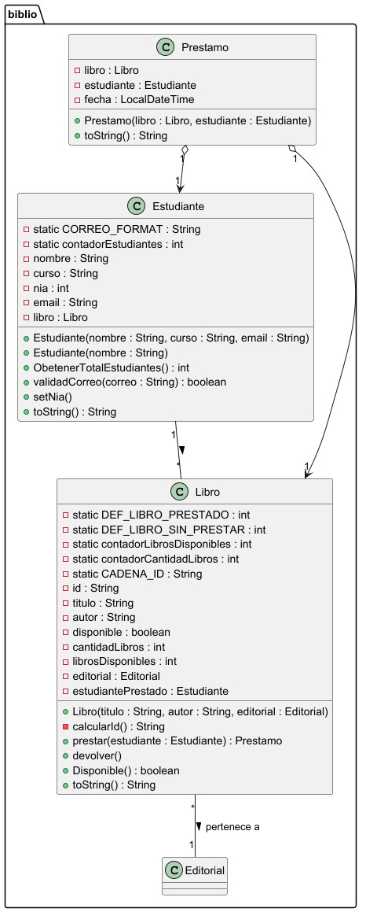

# Practica 1. Práctica de compre-venta de casas

## Índice 
1. [Intro ](https://github.com/cristiansanchezmad-cmyk/Objetos/new/main/src/main/java/org/example/Tenis#1intro)
2. [Estructura de clases](https://github.com/cristiansanchezmad-cmyk/Objetos/new/main/src/main/java/org/example/Tenis#2-estructura-de-clases)
   - Diagrama de clases UML
   - Codigo de PlantUML
   - Contenido de las clases (.java)
4. [Programa Principal (InmobiliariaApp)](https://github.com/cristiansanchezmad-cmyk/Objetos/new/main/src/main/java/org/example/Tenis#3-programa-principal-inmobiliariaapp)
5. [Pruebas](https://github.com/cristiansanchezmad-cmyk/Objetos/new/main/src/main/java/org/example/Tenis#4-pruebas)
6. [Entregas](https://github.com/cristiansanchezmad-cmyk/Objetos/new/main/src/main/java/org/example/Tenis#5-entregas)

### 1.Intro
> La practica consiste en objetos
### 2. Estructura de clases
#### Diagrama de clases UML

#### Codigo de PlantUML
`````
package "biblio" {

    class Estudiante {
        - static CORREO_FORMAT : String
        - static contadorEstudiantes : int
        - nombre : String
        - curso : String
        - nia : int
        - email : String
        - libro : Libro

        + Estudiante(nombre : String, curso : String, email : String)
        + Estudiante(nombre : String)
        + ObetenerTotalEstudiantes() : int
        + validadCorreo(correo : String) : boolean
        + setNia()
        + toString() : String
    }

    class Libro {
        - static DEF_LIBRO_PRESTADO : int
        - static DEF_LIBRO_SIN_PRESTAR : int
        - static contadorLibrosDisponibles : int
        - static contadorCantidadLibros : int
        - static CADENA_ID : String
        - id : String
        - titulo : String
        - autor : String
        - disponible : boolean
        - cantidadLibros : int
        - librosDisponibles : int
        - editorial : Editorial
        - estudiantePrestado : Estudiante

        + Libro(titulo : String, autor : String, editorial : Editorial)
        - calcularId() : String
        + prestar(estudiante : Estudiante) : Prestamo
        + devolver()
        + Disponible() : boolean
        + toString() : String
    }

    class Prestamo {
        - libro : Libro
        - estudiante : Estudiante
        - fecha : LocalDateTime

        + Prestamo(libro : Libro, estudiante : Estudiante)
        + toString() : String
    }

    class Editorial {
    }

    ' Relaciones
    Estudiante "1" -- "*" Libro : >
    Libro "*" -- "1" Editorial : pertenece a >
    Prestamo "1" o--> "1" Libro
    Prestamo "1" o--> "1" Estudiante
}
````

#### Contenido de las clases (.java)
### 3. Programa Principal (InmobiliariaApp)
### 4. Pruebas
### 5. Entregas
- [X] Codigo fuente en Github: [Link]()
